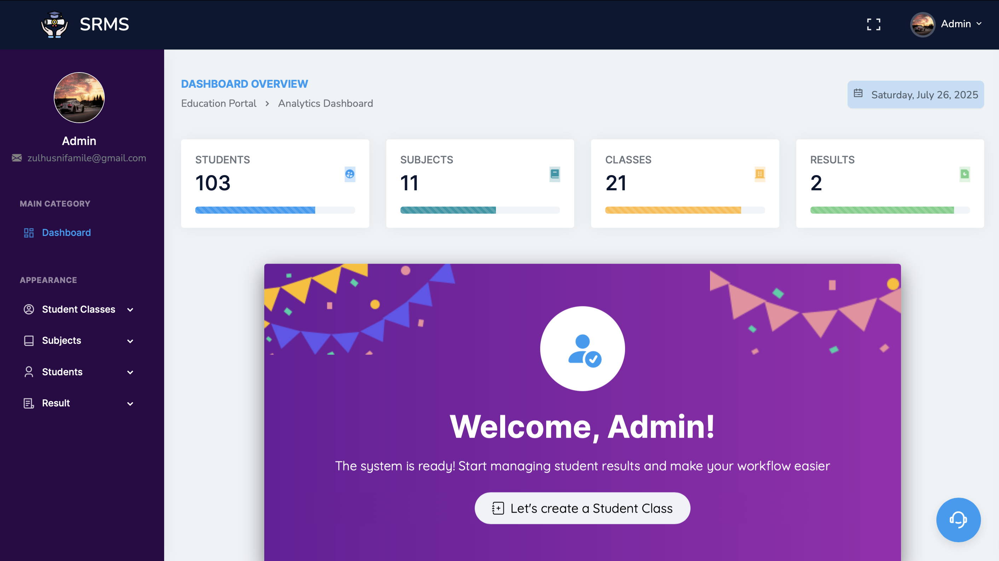
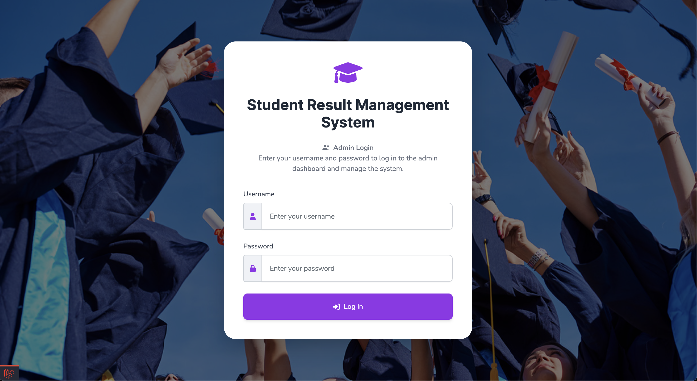

# Student Result Management System (SRMS)

## Overview
Designed for manage and display student results efficiently. It provides an intuitive dashboard for administrators and a student-friendly portal for result retrieval.

## Live Demo
You can try the deployed version of the project here:

- 🌐 [Student Login](https://srms.get-virtual-admin.com/)
- 🔐 [Admin Login](https://srms.get-virtual-admin.com/login)

## Features
- **Admin Dashboard:** View statistics on total students, total subjects, total classes, and total results.
- **Student Management:** Manage student classes, subjects, students, and results.
- **Result Portal:** Students can view their academic performance by entering their Roll ID and selecting their class.
- **User Authentication:** Secure login with profile management.
- **Admin Profile Management:** Admin can update their profile & change their password.

## Screenshots

### Dashboard
<p align="center">
    
</p>
<p align="center"><em>Admin dashboard displaying system statistics.</em></p>

### Student Result Page
<p align="center">
    
</p>
<p align="center"><em>Academic performance.</em></p>

### Admin Login Page
<p align="center">
    
</p>
<p align="center"><em>Login page for administrators.</em></p>

### Student Login Page
<p align="center">
    
</p>
<p align="center"><em>Login page for students.</em></p>

## Installation
### Prerequisites
- PHP (>=8.0)
- Composer
- MySQL
- MAMP (for local server management)
- Sequel Ace (for database management)
- Laravel

### Step-by-Step Installation
1. Clone the repository:
   ```sh
   git clone https://github.com/MuhammadZulhusni/Student-Result-Management-System.git

2. Navigate to the project directory:
   ```sh
   cd Student-Result-Management-System
   ```
3. Install dependencies using Composer:
   ```sh
   composer install
   ```
4. Copy the `.env.example` file to `.env`:
   ```sh
   cp .env.example .env
   ```
5. Generate the application key:
   ```sh
   php artisan key:generate
   ```
6. Configure the database in the `.env` file:
   ```env
   DB_CONNECTION=mysql
   DB_HOST=127.0.0.1
   DB_PORT=3306
   DB_DATABASE=your_database_name
   DB_USERNAME=your_database_user
   DB_PASSWORD=your_database_password
   ```
7. Run database migrations:
   ```sh
   php artisan migrate
   ```
8. Seed the database:
   ```sh
   php artisan db:seed
   ```
9. Start the development server:
   ```sh
   php artisan serve
   ```
10. Open your MySQL server and ensure the database is running. 
    - In my case, I used **MAMP** for server management and **Sequel Ace** for database management, but you can use other tools dedicated MySQL server depending on your setup.

## Default Login Details
### Admin Login
- **Username:** Admin
- **Password:** password

## Accessing the Backend
Once the server is running, access the admin login page by navigating to:

```
http://localhost:8000/login
```

Log in using the admin credentials (if seeded, check the database or default credentials). Upon successful login, you will be redirected to the admin dashboard where you can manage students, classes, subjects, and results.

## Technologies Used
- **Framework:** Laravel
- **Frontend:** HTML, CSS, JavaScript, Bootstrap
- **Backend:** PHP, Laravel
- **Database:** MySQL
- **Server Management:** MAMP
- **Database Management:** Sequel Ace

Contributions and suggestions for improvements are welcome.

